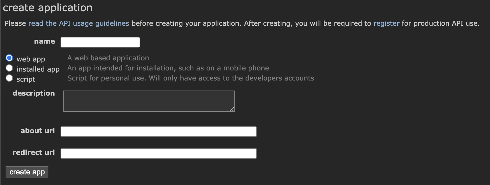
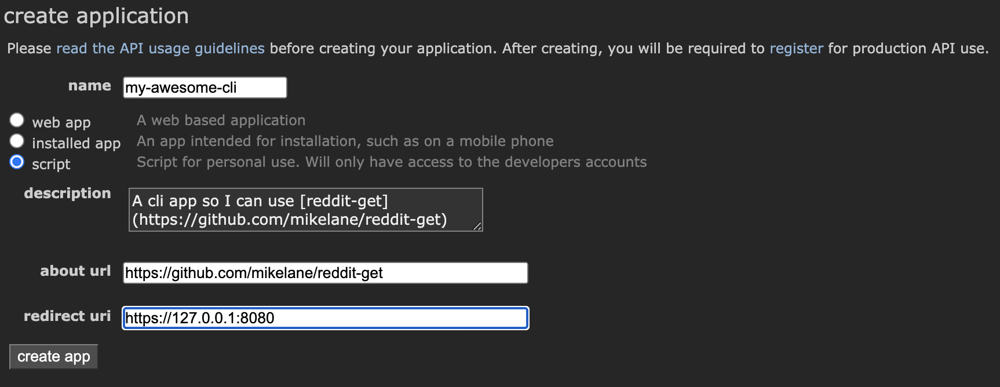

# Reddit Get

This is a python CLI that will pull posts from Reddit. In order to use this CLI, you'll need to set up a 
Reddit app of your own so that you can authenticate into Reddit with your own credentials. Never fear, 
this process is pretty straight forward.

## Installation

Using python 3.8 or later, run `pip3 install reddit-get`. But also, you need to set up a reddit cli app so 
you can access reddit through the command line. See below for that.

### Create a Reddit Application

1. Navigate to https://reddit.com/prefs/apps
1. Click `create an app`
1. You should see something like this:

    

1. You can then fill this form out with some values like these (choose whatever you like):

    

After that, you'll need to find the `client_id` and `client_secret` for your new app and insert those into 
a configuration file on your system.

### Adding a Reddit-Get Config File

1. Create a file in your home directory called `.redditgetrc` (currently this is the default name and is 
   only configurable when you call the script each time, so this name is probably for the best for now)
1. Make your reddit config file look like this:

    ```toml
   [reddit-get]
   client_id = "<your client id here>"
   client_secret = "<your client secret here>"
   user_agent = "<anything, e.g. My super awesome cli app by u/pm_me_myour_apps>" 
   username = "<your reddit username>"
   password = "<your reddit password>"
   ```

Once this is set up, you should be good to go. 

## Example Usage

Once you've got your cli app set up and reddit-get installed, you can run it like this:

```shell
$ reddit-get post --subreddit showerthoughts --post_sorting top --limit 10 --time_filter all --header --markdown
```
And here's what was returned today:

```markdown
##### *Top Posts from r/showerthoughts*
- *Whoever created the tradition of not seeing the bride in the wedding dress beforehand saved countless husbands everywhere from hours of dress shopping and will forever be a hero to all men.*
- *We laugh at dogs getting excited when they hear a bark on TV, but if TV was a nonstop stream of unintelligible noises and then someone suddenly spoke to you in your language, you'd be pretty fucking startled too.*
- *When you're a kid, you don't realize you're also watching your mom and dad grow up.*
- *Dads probably bond with dogs so much because, in our society, men don’t get shown a lot of affection but dogs give tons of affection regardless*
- *Being able to tolerate the sound of your own voice in a video is probably the highest form of self acceptance.*
- *Girls don't compliment guys because they're likely to take it non-platonically, guys take it non-platonically because it happens so infrequently they don't know how to handle it*
- *If elevators hadn't been invented, all the CEOs and important people would have their offices on the first floor as a sign of status.*
- *If EA suffers big enough losses from the backlash of Battlefront 2, and it all started because some guy couldn't unlock Vader, this will be the second time Anakin brought balance to something.*
- *Being able to do well in high school without having to put in much effort is actually a big disadvantage later in life.*
- *During a nuclear explosion, there is a certain distance of the radius where all the frozen supermarket pizzas are cooked to perfection.*
```

For more help with the post command, you can of course run

```shell
$ reddit-get post --help
```

---

Enjoy! This is early stages, so I'll be adding more features as time goes on.
